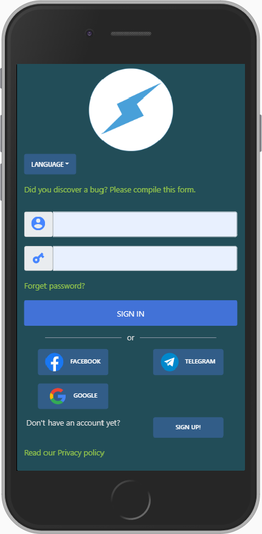

# Bolt TTS Wallet

❤️❤️❤️ A wallet using Naples Payment Token, implementing a lot of PWA love. ❤️❤️❤️

## Authors

- [Sergio Casizzone](https://altervista.sergiocasizzone.it)

## Features

**Wallet**

  - [x] Desktop & Mobile Layout
  - [x] Social Login (Telegram, Facebook, Google)
  - [x] `Tokens` Balance
  - [x] Token send & receive
  - [x] Available in many languages (english, italian)
  - [x] Transactions list
  - [x] Transaction details
  - [x] Blockchain sync & rescan

**PWA**

  - [x] Service Worker
  - [x] Push messages
  - [x] Save coin send requests for offline use^

  (^) when the app returns on-line, memorized requests will be executed!   

**Security**

  - [x] PIN protected access
  - [x] Google 2FA Login
  - [x] Seed management with recovery wallet
  - [x] BIP32 passphrase

## Security

If you discover or learn about a potential error, weakness, or threat that can compromise the security of Wallet, we ask you to keep it confidential and [submit your concern directly to the BOLT Wallet security team](mailto:jambtc@gmail.com?subject=[GitHub]%20Bolt%20Security).

## License

This project is open source under the MIT license, which means you have full access to the source code and can modify it to fit your own needs. See [LICENSE](LICENSE) for more information.

[MIT](LICENSE) ©2020 Napoli Blockchain

[issues]: https://github.org/napoliblockchain/bolt/issues

### Authors                       
Made with ❤️ by **napoliblockchain.it**
